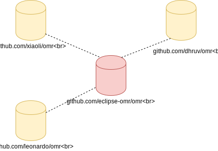
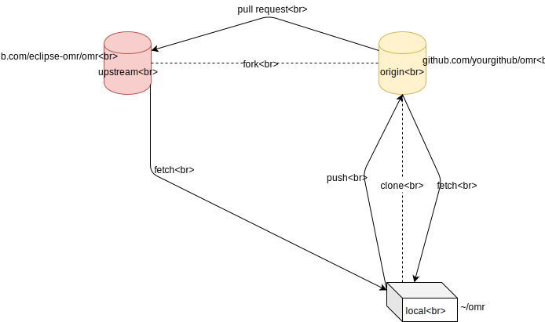
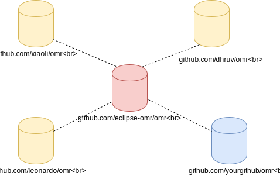
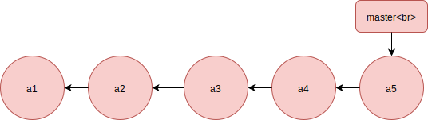
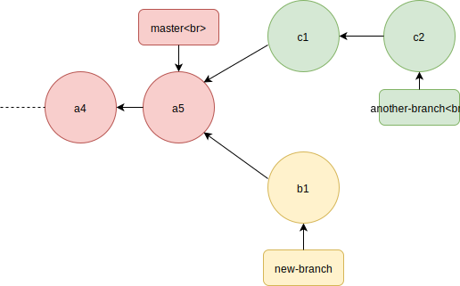
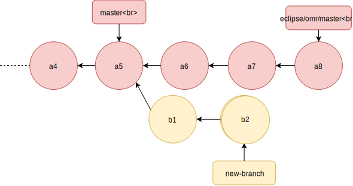
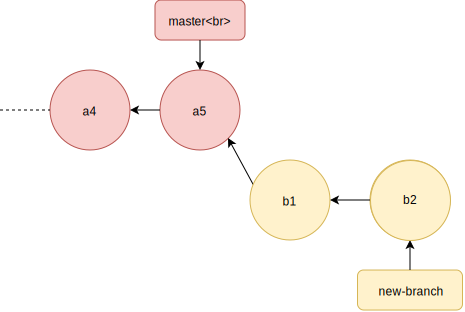
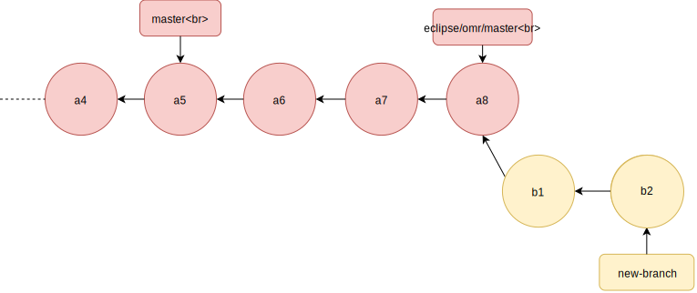

<!--
Copyright (c) 2020, 2020 IBM Corp. and others

This program and the accompanying materials are made available under
the terms of the Eclipse Public License 2.0 which accompanies this
distribution and is available at http://eclipse.org/legal/epl-2.0
or the Apache License, Version 2.0 which accompanies this distribution
and is available at https://www.apache.org/licenses/LICENSE-2.0.

This Source Code may also be made available under the following Secondary
Licenses when the conditions for such availability set forth in the
Eclipse Public License, v. 2.0 are satisfied: GNU General Public License,
version 2 with the GNU Classpath Exception [1] and GNU General Public
License, version 2 with the OpenJDK Assembly Exception [2].

[1] https://www.gnu.org/software/classpath/license.html
[2] http://openjdk.java.net/legal/assembly-exception.html

SPDX-License-Identifier: EPL-2.0 OR Apache-2.0 OR GPL-2.0 WITH Classpath-exception-2.0 OR LicenseRef-GPL-2.0 WITH Assembly-exception
-->

# Git Crash Course

Git is an open-source distributed version control system that the Eclipse
OMR project uses for tracking code changes. Git is considered a distributed
version control system because every contributor to a project can have a
complete copy of a repository and make changes independently. The contributors
could then request to have their code changes reviewed and merged into the main
project repository, making it possible for large open-source projects such as
Eclipse OMR to have many contributors.

You will need to be able to work with git to make code contributions to
Eclipse OMR. This guide is meant to help you get started and understand
the project's workflow using git and GitHub by walking you through the process of
making your first contribution to the Eclipse OMR project hosted on GitHub.
It is by no means a complete guide for all you can do with git -- there
are plenty of excellent online resources for that.

# Setting up git and GitHub

This guide will focus on using git on the command line. You may use a git GUI
application additionally/instead if you so choose.

### Installation

**Linux**

To install git on RPM-based Linux distribution (eg. RHEL), enter the
following shell commands:
1. `yum update`
2. `yum install git`

If you are running a Debian-based distribution (eg. Ubuntu):
1. `apt-get update`
2. `apt-get install git`

Note: Depending on your user settings, you may need to prefix the commands
above with `sudo`.

**macOS**

Launch Terminal.app and install Command Line Tools by entering the
following command:

```
xcode-select --install
```

This command will install git as well as a number of other development
tools for the command line such as make, clang, svn, etc.

**Windows 10**

There are many ways git can be installed and used on Windows, but the
simplest way would be downloading the installer from [git-scm download
page](https://git-scm.com/download/win), and following the installation
wizard.

---

### Sign the Eclipse Contributor Agreement (ECA)

Before you can make any code contributions to the Eclipse OMR GitHub repository
you must sign the Eclipse Contributor Agreement (ECA).  This is a simple process
outlined in the [Contribution Guidelines](../CONTRIBUTING.md#legal-considerations).
This step is important because each of your commits must be signed off by the
same email you used to sign the ECA.

---

### Configure git

**Setting up commit author identity**

After installation, you should configure your name and email address to
associate with any commits you make using the following commands:

```
git config --global user.name "Your Name"
git config --global user.email "your.email@yourdomain.com"
```

The `--global` argument used above instructs git to configure `user.name`/
`email` globally and associate them with any commits you make. If you
would like to override either the name or email in a specific project,
simply go into the project directory and enter any of the above commands
with the project-specific name/email to use and excluding the `--global`
argument.

Please note that the email associated with the commits you make in OMR must
be the email you used for signing the
[ECA - Eclipse Foundation Contributor Agreement](http://www.eclipse.org/legal/ECA.php).
Therefore, you must either configure the global `user.email` or the OMR
project-specific `user.email` to the email used for signing the ECA.
For more information, see the [Legal Considerations section in the contributing
guidelines](../CONTRIBUTING.md#legal-considerations).

**Changing default text editor**

You will need to use a text editor to perform certain actions with git.
Unlike Windows, macOS and Linux users do not get to specify the editor to
use with git during installation. You may instruct git to use a different
text editor instead of the default using the following command:

```
git config --global core.editor <your-favourite-editor>
```


### GitHub

Now that you have git set up, the next step is to [create a free GitHub
account](https://github.com/join) if you do not already have one.
Make sure to add your full name to the GitHub profile.

The next step is to add your public SSH key to your GitHub account so that
you do not have to enter your GitHub username and password every time you
use your git installation to push an update to a repository on GitHub that
you have write access to.

If you did not already generate a SSH key for your machine, here are the
steps to generate one:
1. In Terminal/Command Prompt, enter
`ssh-keygen -t rsa -b 4096 -C "your.email@yourdomain.com"`. `-t` specifies
the type of key to create, `-b` specifies the length in bits of the key, and -C
adds a comment to the end of your generated public key that you could use as an
identifying text.
2. You will go through a number of steps asking for the file location/name,
passphrase, etc. You may leave them as default unless you are creating a
special private-public key pair for just GitHub. Unless you leave the
passphrase as blank, you will be prompted to enter the passphrase every
time you need to use your private key.
3. The generated keys will be located in `c:\Users\<username>\.ssh\` on Windows,
`/Users/<username>/.ssh/` on macOS, and `/home/<username>/.ssh` on Linux. By
default, the keys will be named `id_rsa` (private key) and `id_rsa.pub` (public key).

Copy the contents of your public key (`id_rsa.pub`) to your clipboard. On
GitHub, browse to Settings and then click `SSH and GPG keys`. Click `New
SSH key` button and paste the public key. Use a title for the key so that
you can tell where this key originated from later.

# Making your first contribution using git and GitHub

Now that you have git and GitHub set up, you are ready to start
contributing! In this section, we will go through the steps to
making your first contribution. Let's begin by looking at the
overall development workflow.

### OMR development workflow

Git being a distributed version control system means that there are
multiple copies of the repository that can exist, but only one main
repository that contributors use to submit changes, as well as for
updating their own copies. For OMR, the main repository is
[`eclipse/omr`](https://github.com/eclipse/omr).
Every contributor to the OMR project needs to have their own **fork** on
GitHub.

  
*Figure 1: Distributed VCS model with contributors having their own copies (forks) of OMR*

A fork is simply a copy of a repository in your own GitHub account that
you can make changes to independently. You do not work directly on your fork
on GitHub, but instead make a **clone** of your fork on your local machine
and pushing your changes to your fork. You will then have to open a pull
request to merge your changes into the main OMR repository. Figure 2 below
outlines the process.

  
*Figure 2: OMR development workflow*

In the diagram above, there are 3 copies of the repository. The `yourgithub/omr`
repository is forked from the main `eclipse/omr` repository, which you clone to
your machine as `~/omr`. On your machine, git aliases `yourgithub/omr` as `origin`.
However, git does not know whether the repository you cloned is actually a fork.
In order to keep up with updates made to `eclipse/omr`, you will need to track
changes in that repository, and call it `upstream`. Notice how there is no arrow
going from `upstream` to `origin`, which means keeping your fork up to date is
your responsibility. This is done by performing **fetch** from `upstream` to
your local repository, updating your local branches, and then performing **push**
to your fork `origin`.

The sections below will walk you through the different stages of this development
process.

### Issues

Issues on GitHub are a great way for project contributors to collaborate.
The Eclipse OMR project makes use of [Issues](https://github.com/eclipse/omr/issues)
mainly for keeping track of tasks, bugs, and discussions out in the open.

Issues can be categorized using coloured labels (eg, `compiler`,
`beginner`,`backlog`, `help wanted`). If you are making your first
contribution to Eclipse OMR, it is a good idea to tackle an issue labelled
`beginner` before taking on more challenging tasks. Clicking on `Labels` drop
down menu and selecting `beginner` label will show you issues with that label.

### Create a fork

After picking an issue to work on, you will need to create a fork so that
you can open a Pull Request to have your contribution reviewed and merged.
To create a fork, simply click on `Fork` near the top of the OMR
repository page on GitHub.

Now that you have created a fork, you too have a copy of the OMR
repository in your GitHub account like the other contributors!

  
*Figure 3: New fork created*

### Clone your fork locally

The next step is to clone your forked OMR repository so that you can make
changes locally. Navigate to the directory you'd like to clone the
repository to, and enter the following command:

```
git clone git@github.com:yourgithub/omr.git <directory-to-clone-into> <-b branch-to-check-out>
```

The command above will clone the omr repository to your machine using SSH.
The parts within the angled brackets are optional. Without those options,
your repository will be cloned into a directory named `omr`, and the
default branch, which is `master` in this case.

### Create a new branch

Navigate to the directory the repository was cloned into. To check the
state of the repository, type the command `git status`, which should output

```
On branch master
nothing to commit, working tree clean
```

This indicates that you are currently on master branch, and no changes
were made in this branch that you can commit.

  
*Figure 4: The master branch*

Branching allows splitting the chain of commits made in a repository. The branch
name is used to identify different branches in a repository. The master branch
should not be where you make your changes. Instead, use it to create new branches
off of.

To create a new branch, enter the following command:

```
git branch new-branch
```

  
*Figure 5: Creating a new branch*

You will now have a new branch named `new-branch`, and since you created
a new branch off of your current branch (`master`), both the branches
will be pointing to the same commit.

At this point, you simply created a new branch, but you are still on
`master` branch. To switch to a new branch enter the following command:

```
git checkout new-branch
```

To do the 2 commands above in a single step, enter

```
git checkout -b new-branch
```

Adding new commits to your branches will leave `master` untouched. Using
branches, you can create multiple chain of commits independently, as the
diagram below demonstrates with an additional branch `another-branch`:

  
*Figure 6: Multiple branches with their independent chain of commits*

To see the current branches in your local repository, simply enter `git branch`,
and it will show your local branches and highlight the branch you are
currently working on.

### Stage and commit your changes

Now that you have a new branch to work on, you may make your changes. Once
you are done, you will have to stage the files and commit them once staged.

Staging files is just like "saving" them to include in a commit. To stage
a file, enter the following command:
```
git add <filename>
```

You may also stage all the files you changed in a single step. The option
following add determines what gets staged:
1. `git add -u` - stage all modifications to existing files only
2. `git add .` - stage all modifications to existing files and any new files added
3. `git add -A` - stage everything, including deletion of files

After staging, you may make a commit, and a text editor will open up where
you will need to write a commit message. Enter the command below to make a
commit:

```
git commit
```

Your commit message will need to be written according to Eclipse OMR's [commit
guidelines](../CONTRIBUTING.md#commit-guidelines) found in `CONTRIBUTING.md`
document in the repository. Here is an example of a commit message adhering to
the OMR project's commit guidelines taken from that section of `CONTRIBUTING.md`:

```
Update and expand the commit guidelines

Elaborate on the style guidelines for commit messages. These new
style guidelines reflect the conversation found in #124.

The guidelines are changed to:
- Provide guidance on how to write a good first line.
- Elaborate on formatting requirements.
- Relax the advice on using issues for nontrivial commits.
- Move issue references from the first line to the message footer.
- Encourage contributors to put more information into the commit
  message.

Issue: #124
Signed-off-by: Robert Young <rwy0717@gmail.com>
```

The first line in the commit message is the commit heading, and should
summarize what this commit is doing. After a blank line comes the body of
the commit message containing more details about what this commit is
about. You can be as descriptive of the changes as you wish.

Next, you may include the Issue in OMR that this commit addresses,
followed by signing off the commit.

Tips: `git commit -a` combines the 2 commands:
1. `git add -u`
2. `git commit`

You can also generate the `Signed-off-by:` information in your commit message
from your `user.name` and `user.email` settings using the `-s` flag in your
`git commit` command.

### Push branch to your fork

After you have committed, you may push your `new-branch` branch to your
fork on GitHub that will create a new branch on your fork with the same name.
To do so, enter the following command:

```
git push origin new-branch
```

In the command above, `origin` is an alias for the URL of your fork. By default,
git sets `origin` to the "remote" repository you cloned from.

### Open a Pull Request

Go to your fork's GitHub page and select your recently pushed branch from the
drop-down menu near the top left. Then, click on `New Pull Request` button
right beside that to navigate to the pull request creation page.
Alternatively, if you recently pushed your branch, you may see a prompt to
open a Pull Request using that branch right away.

In the pull request creation page, you can see what branch of eclipse/omr
you are going to merge the commit(s) in your branch into. Your Pull
Request title should describe what is being done, and the body of the Pull
Request can be used to add further details about what you are doing, as
well as explaining the significance of the contribution you are making.

If you are not ready to have your Pull Request reviewed and merged, but
would just like some feedback as you continue adding more commits, simply
prefix your Pull Request title with `WIP` (ie, Work In Progress), and/or
open the Pull Request as a
[Draft Pull Request](https://github.blog/2019-02-14-introducing-draft-pull-requests/).
This will indicate that you are not ready to have those changes merged.


### Add further changes and make corrections

Suppose you opened a PR with a WIP prefix because you wanted to test your
changes while your code can get some feedback. GitHub allows you to update your
PR by pushing your updated branch to GitHub.

If you wanted to add more commits that are related to the issue you are
working on, it is not too late to do that. Following the steps to making
a commit above, you can push your changes to the same branch in your fork,
and you will see that the Pull Request updated with the new commit you added.

If there was a typo in a part of the code you committed as well as in the
commit message that you noticed after you pushed, it is possible to
easily amend the last commit you made.

Here are the steps to amending the last commit's changes and the message:
1. Make your correction(s)
2. Stage the files that you corrected (or add the `-a` option to the command below)
3. `git commit --amend`

The command above opens a text editor that will allow you to edit the
commit message. If you do not need to amend the commit message, then you
may use the command `git commit -a --amend --no-edit` instead.

Next step after making an amend is to update your branch to reflect your
Pull Request. Unfortunately, you will not be able to push your changes
as you did before, as your commit is now different from the one in your
remote branch due to the amend you made resulting in your local and remote
branches diverging. You will therefore have to overwrite your remote
branch with your local branch. To do that, you need to make a force push
to your `new-branch`:

```
git push -f origin new-branch
```

### Rebase and resolve merge conflicts

If some time has passed between the time you opened your PR and
the time it was ready to be reviewed, it is a good idea to
update your branch so that you may test your code changes being made on
top of a more recent version of OMR. The process of doing that is known as
**rebasing**. To explain rebasing, let's look at how you began developing
on your `new-branch` branch. You created `new-branch` basing it on the `master`
branch you got when you first cloned your fork. Let's suppose you added the
commits `b1` and `b2` to `new-branch`. It would look something like this:

  
*Figure 7: Commits added in your `new-branch`*

Given the number of contributors to the Eclipse OMR project, it is likely that
more commits have been added to `eclipse/omr` resulting your base (local `master`
you created `new-branch` off of) branch being out of sync with `eclipse/omr`'s
master branch that you are trying to merge your changes into.


  
*Figure 8: Outdated base*

The goal of rebasing is to apply your commits on top of the current version of the
branch you are trying to merge your changes into (in this case, `master` branch of
`eclipse/omr`).

  
*Figure 9: Resulting chain of commits after rebase*

Rebasing is also useful when you are trying to resolve **merge conflicts**.
Merge conflicts arise when some other developer gets their commits merged into
`master` in `eclipse/omr` after the point where your branch is based on if your
commits modify/delete the lines that are affected by their commits. Git cannot
automatically determine what to keep and what to discard. You will have to
manually make edits to those conflicting regions in the source files.

Suppose that you have a merge conflict that needs to be resolved. The first
step would be to add `eclipse/omr` repository as a remote to fetch updates
from. Let's alias the URL of `eclipse/omr` as `upstream`.

```
git remote add upstream https://github.com/eclipse/omr
```

Next, fetch the history from `upstream`. Performing fetch of a remote repository
updates what git knows about its history.

```
git fetch upstream
```

Next, you need to rebase your changes on top of `upstream`'s `master` branch.

```
git rebase -i upstream/master
```

The `-i` option in the command above is the option to enter interactive
rebase. It opens your text editor listing the commits being added from
your branch (lines starting with `pick`) on top of upstream's master
branch. There are many other things you can do in an interactive rebase
(eg, reword, squash, change commit order, etc) but in this case, no edits
to the rebase operations are needed. Saving and closing your editor will make
git apply the commits in the order they were, until you hit the first merge
conflict.

Git will tell you the files where there are unresolved conflicts. Open a
conflicting file and look for `<<<<<<<`. This marks the beginning of a
conflicting region. A conflicting region looks like this:

```
<<<<<<
// existing code on upstream/master
========
// your changes
>>>>>>
```

`=======` is used for separating your changes from existing changes.
`>>>>>>>` marks the end of the conflicting region. Manually edit the
conflicting region and remove the 3 conflict region indicating lines.

Once you are done resolving these conflicts, stage the edited files using `git add`.

Now that your files are conflict-free and staged, rebase operation can be
continued using the command below:

```
git rebase --continue
```

Repeat the conflict resolution steps if another conflict occurs.

Rebasing diverges your local `new-branch` from your fork's `new-branch` since
they are no longer based on the same commit history. Therefore, you will need
to overwrite your remote branch with your local branch using the command below:

```
git push -f origin new-branch
```

### Code review and merging of PR

Once your PR is ready to be reviewed, a committer will go through
your changes, leaving review comments asking for clarifications and/or
requesting changes. You will then have to address those comments and
update your branch if needed.

After you addressed the reviewer's comments and concerns, your PR may be
approved and merged by a committer.


# Additional resources

This section contains links to some helpful git documentation/tutorials
that you can refer to if you are trying to do something not covered here.

* [git cheat sheet](https://education.github.com/git-cheat-sheet-education.pdf)
* [git-scm getting started doc](https://git-scm.com/book/en/v2/Getting-Started-About-Version-Control)
* [interactive rebase](https://thoughtbot.com/blog/git-interactive-rebase-squash-amend-rewriting-history)
* [squashing commits](https://stackoverflow.com/questions/5189560/squash-my-last-x-commits-together-using-git)